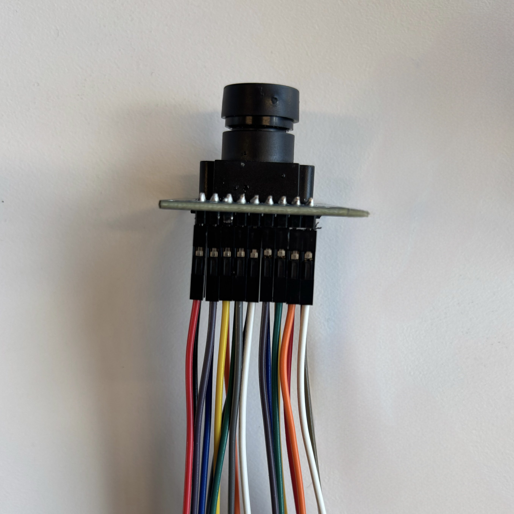
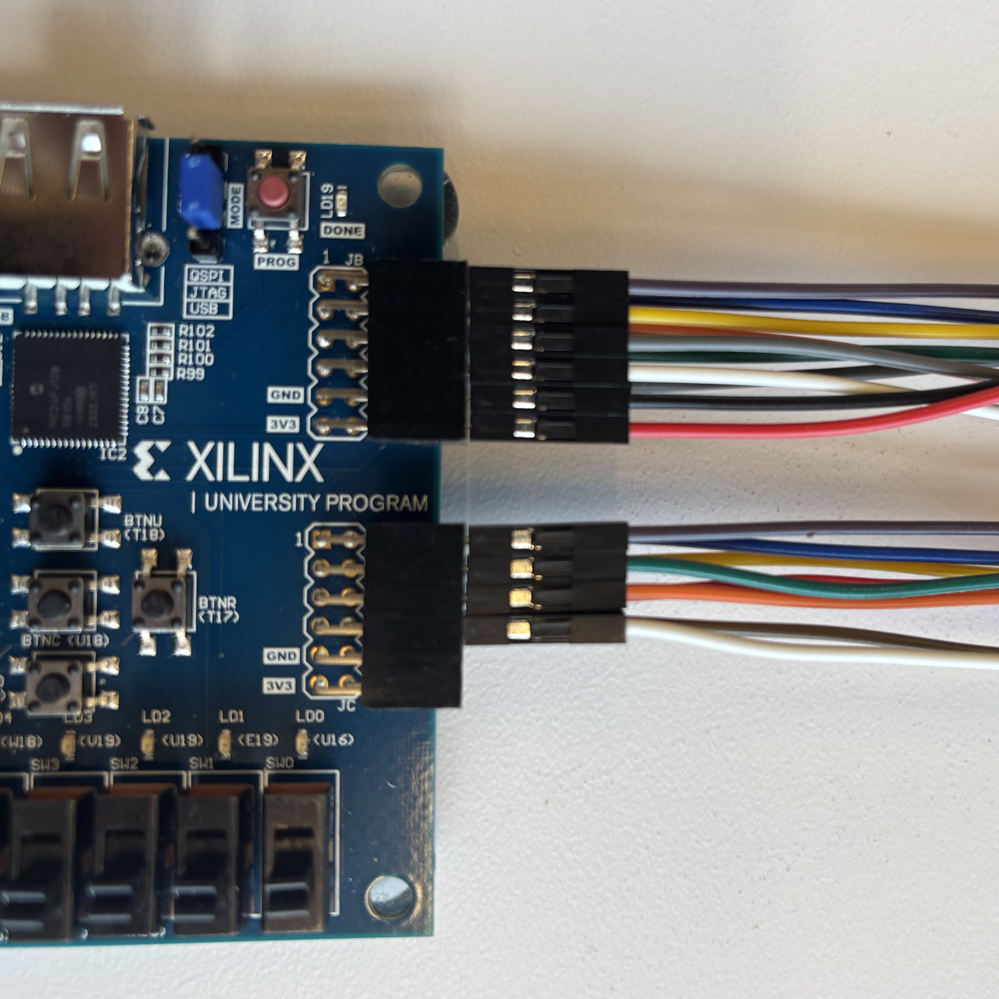

# Real-Time Image Processing & Computer Vision - ZM Development Log

## Overview
This is my personal development log for an FPGA-based **real-time image processing system** using the **Basys 3** board and the **OV7670** camera. My goal is to **interface the camera, process images, and output them to a VGA display**, while overcoming hardware limitations. The original project plan focused on implementing **convolution filters like Sobel and Laplacian**, and I want to compare my work to those initial goals.

---

## March 12  
I spent the day **researching** everything I could about the architecture needed for this project. The **OV7670 camera module** is tricky to configure, and I need to make sure I understand the **SCCB (Serial Camera Control Bus) interface** to communicate with it.  

I also got some essential **wires** from **Eric Liebner**, which I’ll need to connect the camera properly to the FPGA.

---

## March 13  

Today, I **built a cable** to seamlessly interface the **OV7670 camera** with the **Basys 3**. This should make it easier to work with, instead of using messy jumpers.  

I need to make sure the camera is wired correctly to the FPGA’s **GPIO pins**, and then I can start working on data transmission.

### Working on the Constraints File for Basys 3  

Now that the physical connections are in place, I’m starting to work on the **XDC constraints file** to correctly map the **OV7670 camera signals** to the **Basys 3 PMOD ports**.  

Since the **Basys 3** doesn’t have a dedicated camera interface, I have to **manually assign the XCLK, PCLK, VSYNC, HREF, and data lines** to the correct FPGA pins.  

### Key Considerations:  
- **PMOD Pin Limitations**: The camera outputs an **8-bit data bus**, but each PMOD connector only has **8 total pins** for communication. I need to split the connections across multiple PMODs. I will elect to chose PMOD JB and JC.  
- **Clock Signals**: The **PCLK (Pixel Clock)** needs to be mapped correctly for accurate data capture as it is an **external** clock.  
- **SCCB Communication**: The **sio_d (data) and sio_c (clock) lines** for SCCB must be pulled up properly to function correctly.  

This part is **critical**, because if the constraints file is wrong, the FPGA **won’t correctly receive data from the camera**, and nothing else will work.  

Once I finish defining all the mappings, I’ll start testing **basic communication** with the camera to make sure the signals are coming through properly.  

---

## March 14  
Got a **VGA cable** from **Eric Liebner** today. Now I have everything needed to test video output once I get the camera running.

---

## March 16  
Hit my first major roadblock—**my monitor at home doesn’t support VGA**. I had to go to the **NEB lab at UF** to work on it. **Ordered a VGA to HDMI converter** on Amazon so I can work from home in the future.  

I finally got **VGA output working**, and I have a **very rough implementation** of the system running. Right now, the FPGA **reads data from the OV7670 camera and outputs it directly to VGA**, but the image is **really bad**—the colors are completely wrong.  

I suspect the issue is with the **SCCB interface** not writing to the camera registers correctly. I’m using the **RGB565 color format** right now, but I think my data collection process is flawed. Debugging this is my next priority.

---

## March 17  
Made **a ton of progress today** refining and optimizing everything.  

After a lot of trial and error, I **finally got the colors working correctly.** Turns out the issue was **how I was writing to the SCCB registers**—I wasn’t configuring the camera properly. My first attempt at an SCCB interface was really bad, but now it is taking shape.

I have **extensively studied the SCCB interface documentation** and now have a **deep understanding of the 3-phase write transmission process**. I also fully grasp how **SCCB packets are structured** and the exact steps needed to establish **proper communication with the camera**.  

One of the biggest frustrations right now is that **every time I tweak a camera setting, I have to recompile and flash a new bitstream to test it**. This is making development incredibly slow. On top of that, my **SCCB transmitter is glitchy** and sometimes writes the wrong values. I need to fix that too. This is probably due the fact that the Basys 3 buttons are not debounced.

I decided to switch from **RGB565 to RGB444** because of **ugly green artifacts** in the image. (Fun fact: humans perceive green better than any other color, so errors in the green channel are more noticeable.) Changing to **RGB444** was a simple tweak, and it improved the output a lot.  

### Memory Limitations  
One of the biggest problems with this project is **BRAM (Block RAM) limitations** on the Basys 3.  
- Full **VGA (640x480) at 12-bit color** needs **3.6 Mb** to buffer one frame, but the Basys 3 only has **1.8 Mb**—not enough.
- To work around this, I am using **qVGA (320x240) at 12-bit color**, which only requires **0.92 Mb** per frame.  
- This is **more than 50% of my available BRAM**, so adding more image buffers for processing isn’t possible… yet.  

---

## March 18  
Had a **breakthrough idea** today: **use the Basys 3’s 16 switches to configure the camera in real-time.**  

Instead of recompiling the entire design just to change a register, I now use:  
- **Top 8 switches**: Set the **sub-address**.  
- **Bottom 8 switches**: Set the **value** of that register.  

This means I can now **tweak settings on the fly**, making development **way faster**.  

### Scaling Up for Edge Detection  
Since the **first image processing filter I want to implement is a Laplacian or Sobel filter**, I realized something:  
- **Color isn’t necessary for edge detection.** I just need intensity values.  
- Instead of **320x240 color**, I can **go back to full 640x480 resolution in grayscale** and store **1/3 the number of bits per pixel**.  
- This lets me **fit a full VGA frame in BRAM** while still leaving room for processing.  

#### Memory Calculation:  
Previously, I was using **qVGA (320×240) with 12-bit color**:  
`320 × 240 × 12 = 921,600 bits = 0.922 Mb`  

Since full VGA (640×480) at 12-bit color exceeds the BRAM limit:  
`640 × 480 × 12 = 3,686,400 bits = 3.69 Mb` (which is **too large** for Basys 3’s 1.8 Mb BRAM).  

By switching to grayscale at 4 bits per pixel:  
`640 × 480 × 4 = 1,228,800 bits = 1.23 Mb`  

This fits **within the Basys 3’s BRAM**, allowing me to process **higher-resolution images.**

So, how do we convert from 12-bit RGB to 4-bit grayscale?

### Grayscale Conversion Formula  
A grayscale image represents **luminance**, which is how bright each pixel appears to the human eye. Since the human eye is **more sensitive to green**, the most commonly used grayscale conversion formula is: `Gray = 0.299R + 0.587G + 0.114B`

In software, this task would be simple. But, in hardware, it would be better to optimize this calculation in order to decrease the length of the **critical path**. This calculation could be a point where data can go through a lot of logic gates before being latched by a register, so this is an important consideration.

Thus, the way the system calculates the grayscale values uses the following equation:
`Gray = (77R + 150G + 29B) >> 8`

Instead of right shifting by 8, I can simply slice into the top 4 bits of the result of the multiply and add operation-which is equivalent to right shifting by 8. These optimizations approximates the original equation pretty well while also decreasing the hardware complexity considerably.

These optimizations mean that that if I migrate to the **Nexys A7 (4.86 Mb BRAM)**, I will be able to store **two full VGA grayscale frame buffers**, enabling **real-time processing with dual buffering**.   

It took **multiple hours of debugging** (thanks to Vivado being difficult), but I finally got **grayscale VGA working.** Ironically, it worked **on the very first bitstream build** after I solved all the compilation issues.  

### Future Expansion - Nexys A7  
Now that I have a system that **captures, processes, and outputs video**, I’m thinking about the **next step**:  
- The **Nexys A7 FPGA** has **4.86 Mb of BRAM**, which means I could fit **two frame buffers** instead of just one.  
- With two buffers, I can start doing **real-time image processing**, such as **edge detection with Sobel filters**.  
- **Bonus**: The Nexys A7 also has **16 switches and 4 buttons**, which will be **perfect for expanding control options.**  

Right now, I’m considering **using my student discount to get the Nexys A7** and porting my work over.  

---

## March 31  

Polished up and organized everything for **Implementation 1**, and officially pushed it to my GitHub repository under:

basys3/impl1/   ├── vhdl/ 
                ├── constraints/ 
                ├── ip/ 
                └── README.md

### What's New

- Added a note about **what's coming next**:  
  > Implementation 2 will feature **real-time thresholding for pseudocolor imaging** — mapping grayscale values to custom color ranges in hardware.

### VHDL Package Improvements

Created clean, modular packages to improve code readability and reusability:

- `ov7670_addr_pkg.vhd` — defines **all camera register addresses** as constants with hex mappings.
- `ov7670_config_pkg.vhd` — maps key camera configuration presets to full 16-bit write packets, including comments that explain exactly what each configuration **does**, not just what register it writes to.

These packages make the system super flexible, readable, and maintainable — perfect for scaling up to more advanced image processing in later versions.

### Feels like a milestone

Everything is now:
- Working
- Documented
- Organized in GitHub for others (and future me)

Time to shift gears toward **Implementation 2** and start experimenting with **real-time visual effects**.

---

## Next Steps  
- **Fix SCCB Transmitter**: The current implementation's base configuration is still glitchy. I need to clean up the logic and make it more stable.  
- **Implement Thresholding/Pseudocolor**: Should be relatively simple.
- **Implement Edge Detection**: Now that grayscale VGA is working, I can start working on **Sobel and Laplacian filters**.  
- **Migrate to Nexys A7**: More BRAM = dual frame buffers = real-time image processing.  

---

## Final Thoughts  
This has been a **challenging but exciting** project. I’ve had to **work around hardware limitations**, **debug low-level SCCB communication**, and **optimize memory usage** to make this work. Compared to the original project scope, I have successfully implemented **camera interfacing, VGA output, and memory management**, but **image processing filters are the next big challenge.**  

There’s still a lot to do, but I’m **really excited** about where this is going.

---
**Author:** Zachary Mendez  
University of Florida | FPGAtors  